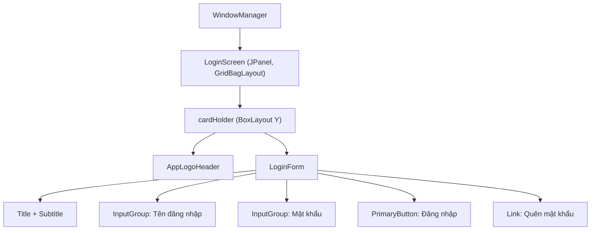
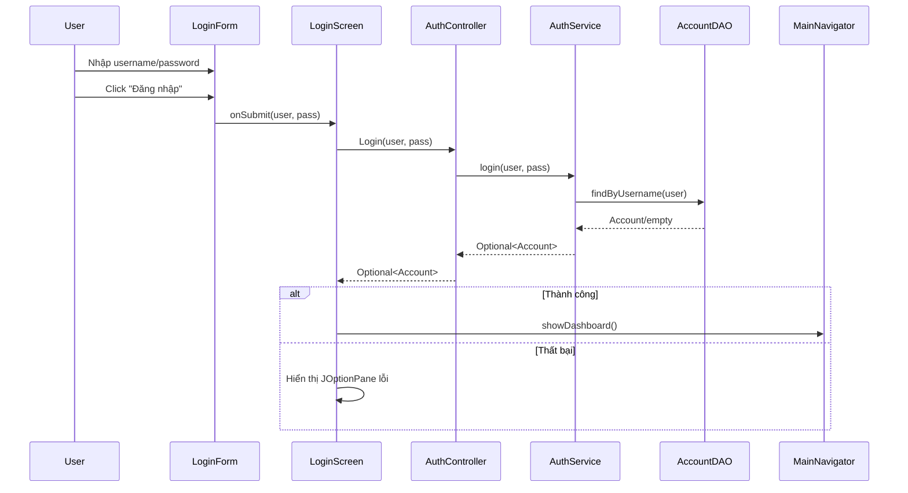

# Hướng dẫn kiến trúc giao diện (View)

Tài liệu này mô tả phần giao diện hiện tại sau khi đã bổ sung kiến trúc mới theo hướng module hóa.

## 1. Mục tiêu kiến trúc

- Tách rõ vai trò giữa:
  - Điều hướng màn hình
  - Khung layout dùng chung
  - Từng tính năng giao diện
  - Component tái sử dụng
- Giảm tình trạng trộn logic điều hướng vào từng `JPanel`.
- Cho phép migrate dần từ code cũ sang code mới mà không phải đập toàn bộ một lần.

## 2. Cấu trúc thư mục View mới

Đường dẫn gốc:

- `src/main/java/com/bangcompany/onlineute/View`

Các nhóm chính:

- `app`
  - `WindowManager`: quản lý một cửa sổ chính của ứng dụng.

- `navigation`
  - `MainNavigator`: điều hướng cấp cao (`showLogin`, `showDashboard`).
  - `PageRegistry`: map `MenuItem -> Page`.

- `layout`
  - `DashboardLayout`: khung chính sau đăng nhập.
  - `MainContent`: vùng nội dung dùng `CardLayout`.
  - `Sidebar`, `TopHeader`: wrapper cho layout dùng chung.

- `features`
  - `auth`: `LoginScreen`, `LoginForm`.
  - `announcement`: `AnnouncementPage`, `CreateAnnouncementPage`.
  - `schedule`: `SchedulePage`.
  - `profile`: `ProfilePage`.

- `shared/components`
  - Các component tái sử dụng: `InputGroup`, `PrimaryButton`, `AppLogoHeader`.

## 3. Luồng chạy tổng quát

1. `OnlineUteApplication` khởi động app và gọi:
   - `MainNavigator.showLogin()`
2. `LoginScreen` nhận thông tin đăng nhập và gọi `AuthController`.
3. Đăng nhập thành công:
   - `MainNavigator.showDashboard()`
4. `DashboardLayout` dựng `Sidebar + TopHeader + MainContent`.
5. Click menu bên trái:
   - `Sidebar` phát sự kiện page key
   - `MainContent.showPage(pageKey)`
   - `PageRegistry` tạo page tương ứng.

## 4. Quy tắc tổ chức code giao diện

- `features/*`:
  - Chứa UI theo từng nghiệp vụ.
  - Không chứa logic truy vấn dữ liệu nặng.

- `shared/components`:
  - Chỉ chứa component tái sử dụng.
  - Không phụ thuộc nghiệp vụ cụ thể.

- `navigation`:
  - Mọi map page nên đi qua `PageRegistry`.
  - Không hard-code điều hướng ở nhiều nơi.

- `layout`:
  - Chỉ xử lý khung hiển thị và phối hợp các khối UI lớn.

## 5. Cách thêm một trang mới

Ví dụ thêm trang `GradePage`:

1. Tạo file:
   - `View/features/grade/GradePage.java`
2. Thêm item menu trong `MenuItem`.
3. Đăng ký map trong `PageRegistry.create(...)`.
4. Nếu cần dữ liệu:
   - UI gọi qua `Controller` (không gọi thẳng DAO).

## 6. Cách thêm một component dùng chung

1. Tạo component mới trong:
   - `View/shared/components`
2. Component nên nhận dữ liệu qua constructor/setter.
3. Không nhúng logic nghiệp vụ vào component dùng chung.

## 7. Nguyên tắc gọi tầng backend từ UI

Ưu tiên:

- `View -> Controller -> Service -> DAO`

Không khuyến nghị:

- `View -> Service` trực tiếp
- `View -> DAO` trực tiếp

Lý do: dễ test, dễ bảo trì và đồng nhất kiến trúc toàn hệ thống.

## 8. Trạng thái hiện tại và hướng migrate

Hiện tại dự án đang ở trạng thái chuyển tiếp:

- Đã có khung `View/app`, `View/navigation`, `View/layout`, `View/features`, `View/shared`.
- Một số class cũ vẫn còn để tương thích tạm thời.

Khuyến nghị migrate theo thứ tự:

1. Migrate các page còn gọi service trực tiếp sang controller.
2. Di chuyển dần component cũ sang `shared/components`.
3. Khi ổn định, loại bỏ package cũ không còn sử dụng.

## 9. Checklist review khi thêm UI mới

- Có đúng thư mục `feature` chưa?
- Đã đăng ký trong `PageRegistry` chưa?
- Có gọi backend qua controller chưa?
- Có tách component dùng chung ra `shared/components` chưa?
- Có tránh hard-code chuỗi/màu lặp lại quá nhiều chưa?

## 10. Sơ đồ component mẫu (Login)

### 10.1 Cấu trúc hiển thị

### 10.2 Luồng sự kiện khi bấm Đăng nhập

